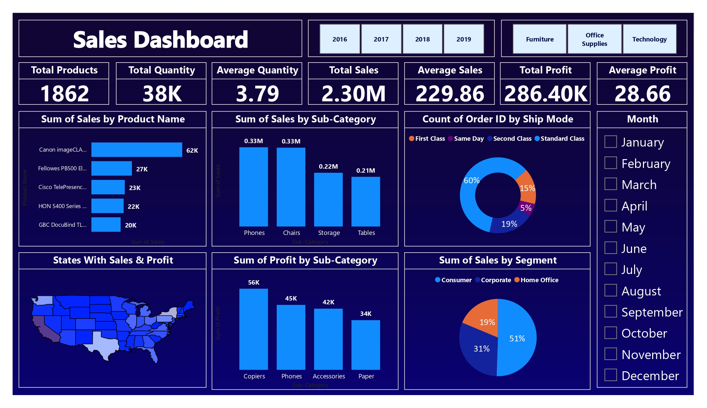

# Sample Superstore Analysis

This Project created by Nisrag Bsc.Data

## Table of Contents
- [Screenshots](#screenshots)
- [Features](#features)
- [Installation](#installation)

## Screenshots

Include screenshots or images showcasing your project. Use relative paths for images inside your project.




## Features

📊 Elevating Sales Analytics with Precision: Unveiling my Power BI Dashboard! 🚀💼
Thrilled to present a comprehensive snapshot of our sales performance through a dynamic Power BI dashboard, meticulously crafted with key KPIs and insightful charts.
📈 Key Performance Indicators (KPIs):
Total Products 🛍️
Total Quantity 📦
Average Quantity 📈
Total Sales 💰
Average Sales 💡
Total Profit 📊
Average Profit 📉
📊 Interactive Charts:
Sales by Product Name: Visualize product-specific performance, identifying top performers and areas for improvement.
Sales by Sub-Category: Explore sales trends within different product categories, guiding inventory and marketing strategies.
Count of Orders by Ship Mode: Understand order distribution by shipping methods, optimizing logistics and delivery efficiency.
State with Sales & Profit: Geo-analyze sales and profit distribution across states, enabling targeted regional strategies.
Profit by Sub-Category: Drill down into profitability within each sub-category, uncovering opportunities for margin improvement.
Sales by Segment: Gain insights into sales performance across different market segments, tailoring strategies for diverse customer segments.
🔄 Dynamic Slicer Filters:
Utilize slicers to seamlessly navigate through data, enabling personalized analysis based on:
Different Years 📅
Various Months 🌐
Specific Sub-Categories 🔄
Harness the power of data with this intuitive dashboard, fostering informed decision-making and strategic planning. Connect with me for an interactive demo and witness firsthand the transformative impact on our sales strategy!
## Installation

Provide instructions on how to install your project. You can include code snippets or commands.

```bash
npm install your-package-name
